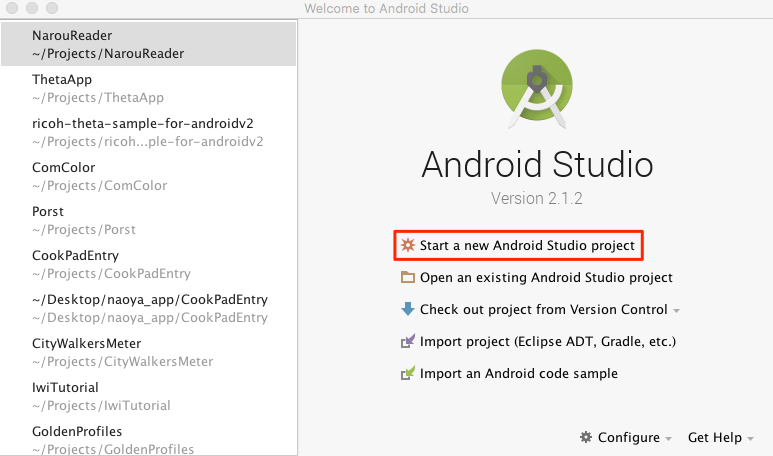
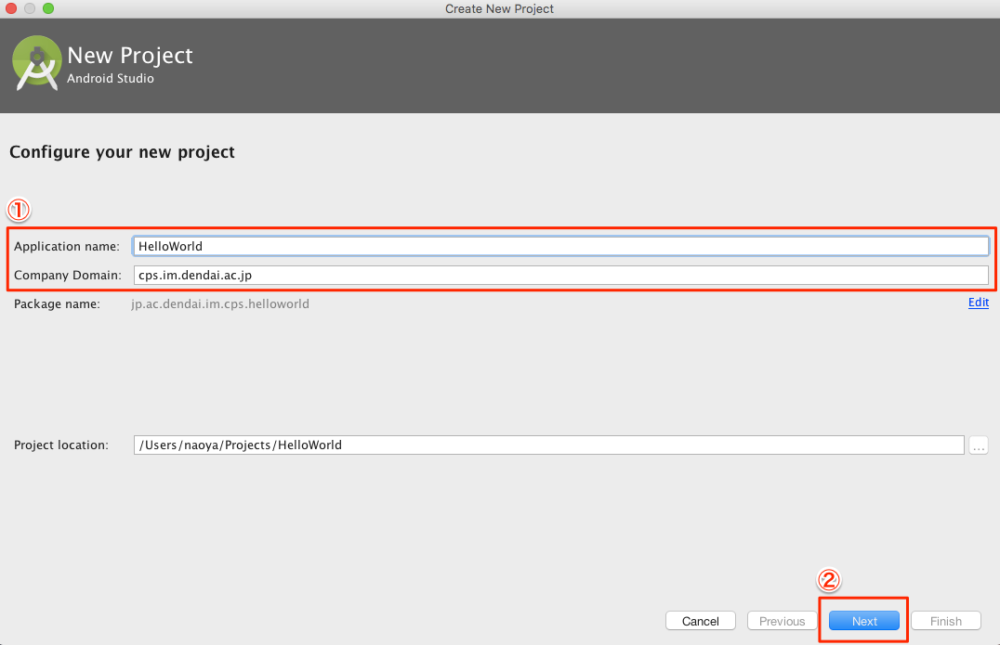
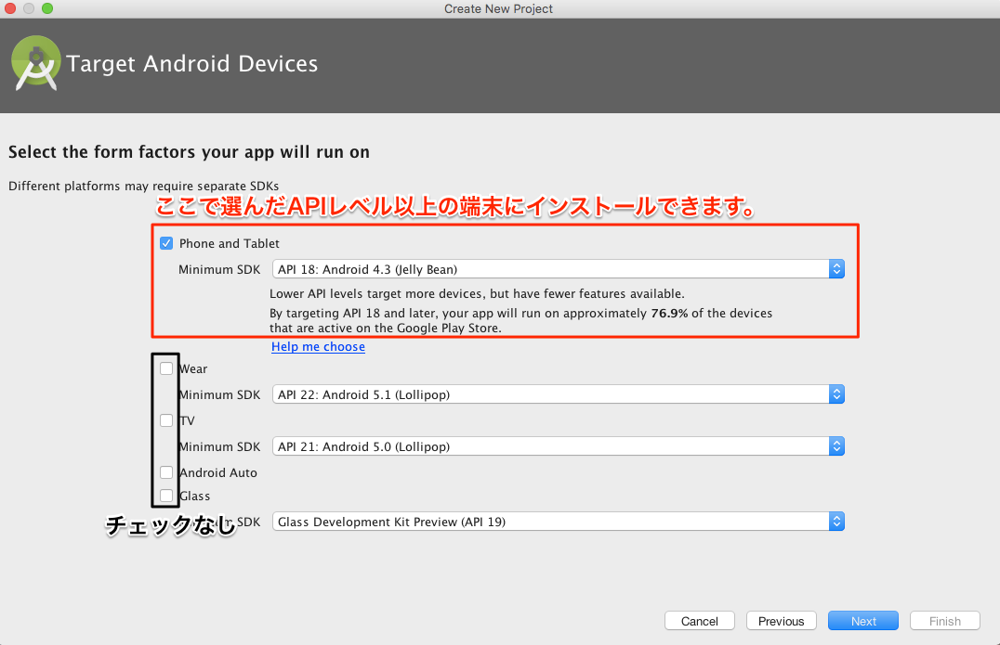
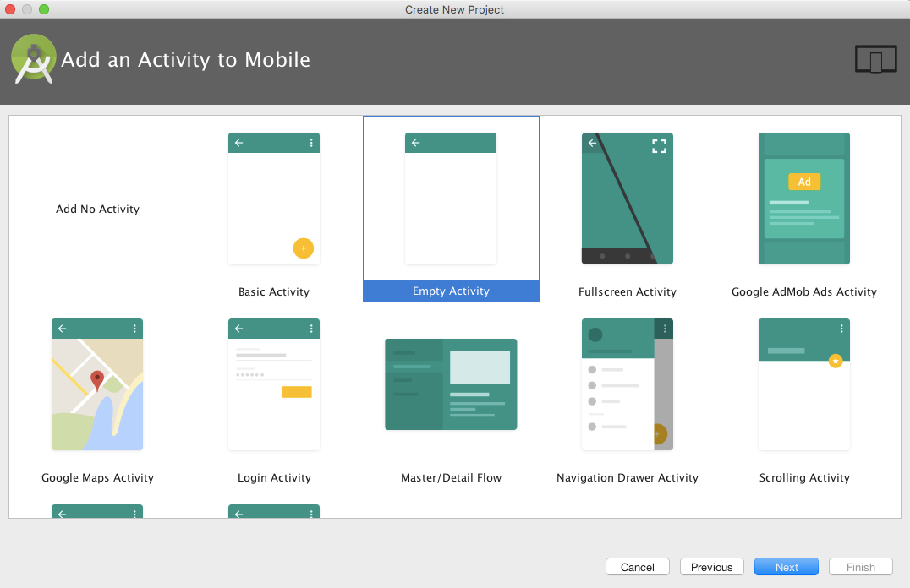
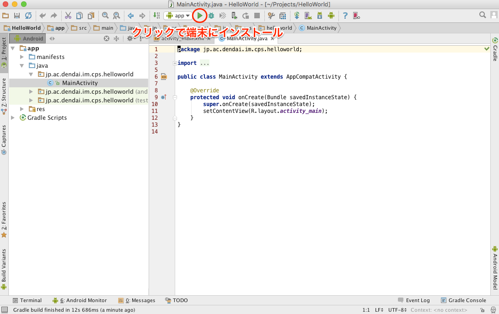
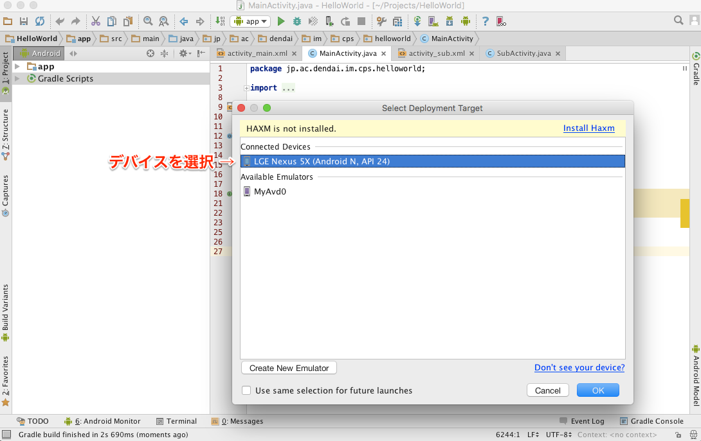
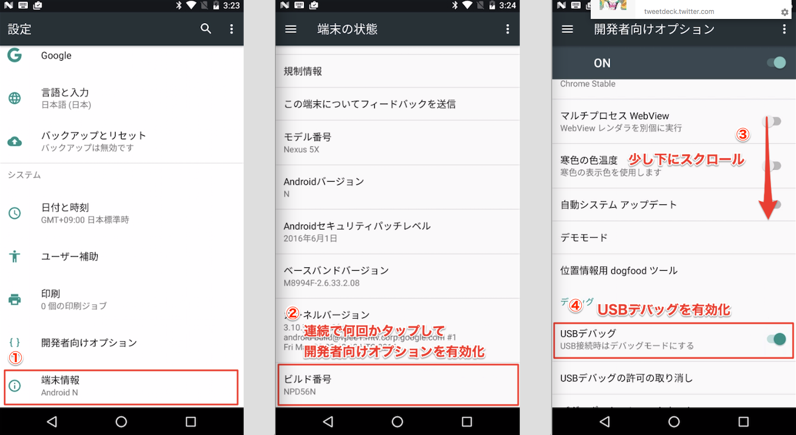
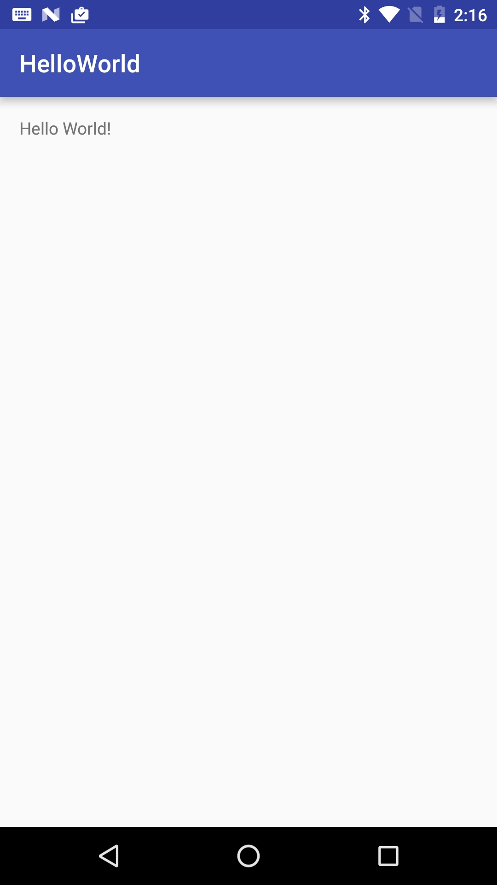

# CPSLAB Android Tutorial
この資料はCPSLABのゼミ生に向けたものです。  
[基礎編はこちら](./document.md)

# Create New Project
`Start a new Android Studio project`をクリック。  

`Application name`と`Company Domain`を入力してNextをクリック。  
`Company Domain`はなんでも良いけど`Package name`になるので自分でわかりやすい名前を付ける。  

`Phone and Tablet`にチェックをいれて`Minimum SDK`を選択します。  
`Minimum SDK`は動作する端末のAPIレベルの指定。指定したAPIレベル以上のAndroid端末でしか動きません。

最初にAndroidStudioが初期化してくれる画面の選択。  
今回は`Empty Activity`を選択。  

いろいろ初期化が終わると下図のような画面が出てくるはずなのでとりあえず端末にインストールできるかのチェック。  
上部の緑色の三角のボタンを押す。  
このときにPCにインストールするAndroid端末を接続しておく。

そうすると下図のような画面が出てくるのでデバイスを選んでOKをクリック。  

上でデバイスが表示されない場合はAndroid端末をPCにUSBケーブルで接続し設定から以下の手順でUSBデバッグを有効化。  

下図のような画面がAndroid端末に表示されたら成功。  

