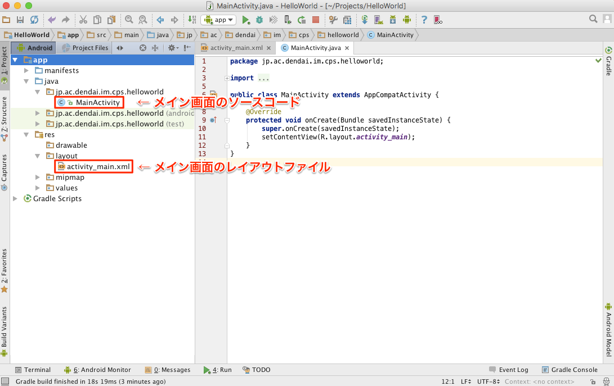
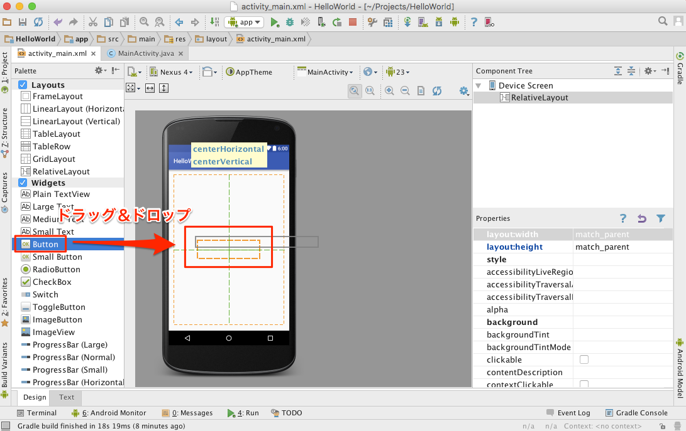
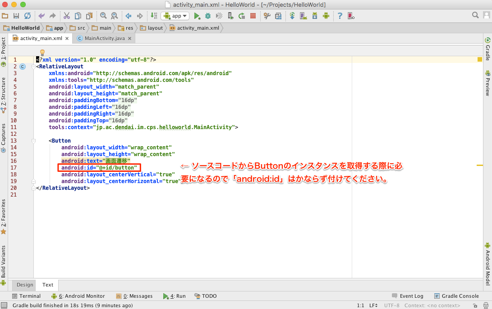
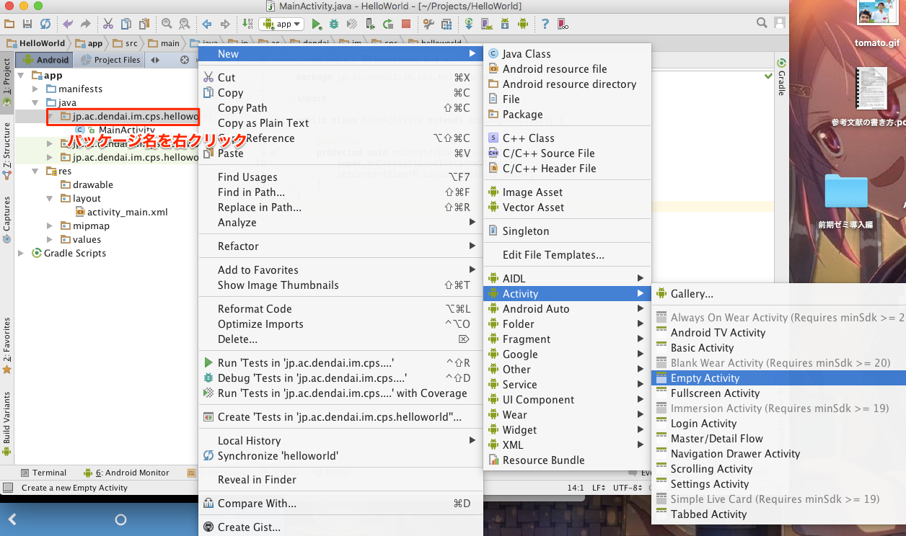
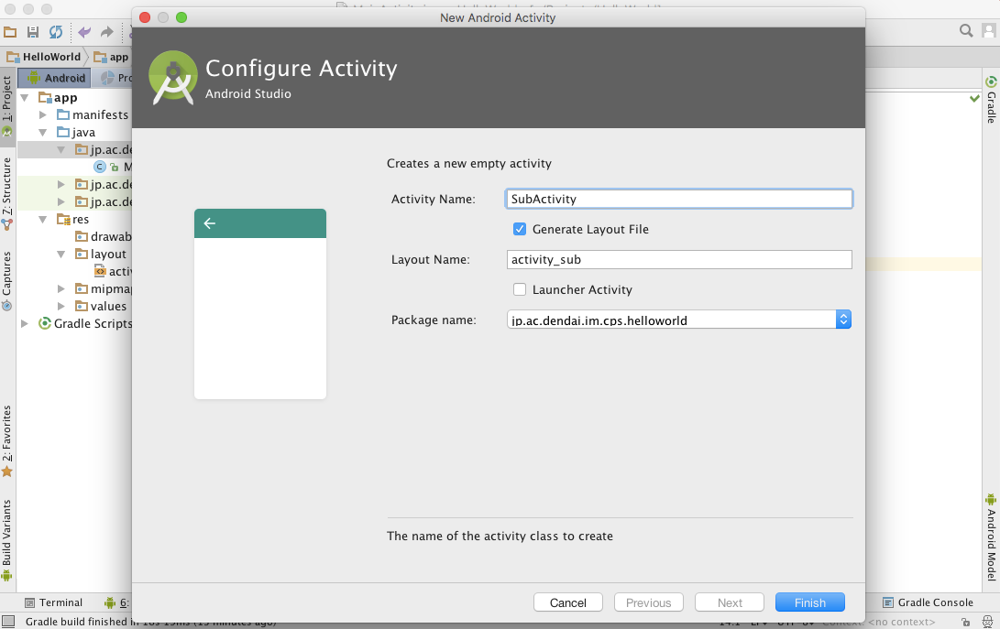
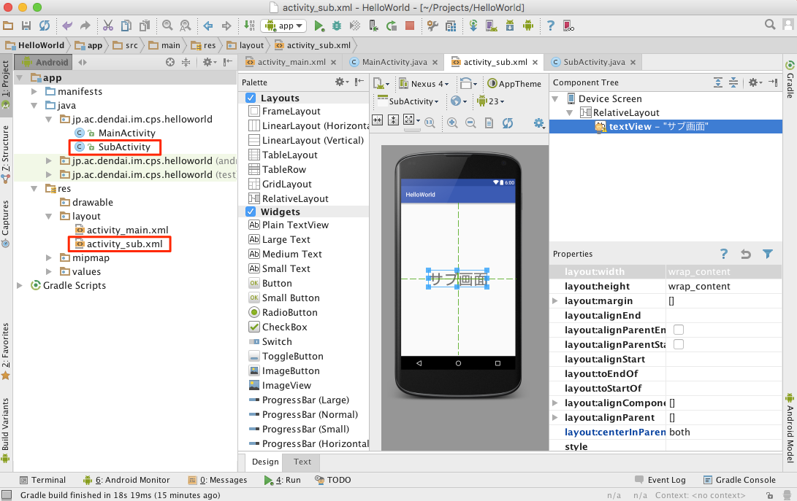

# CPSLAB Android Tutorial
この資料はCPSLABのゼミ生に向けたものです。  
[基礎編はこちら](./document.md)

# Create New Project
`Start a new Android Studio project`をクリック。  


`Application name`と`Company Domain`を入力してNextをクリック。  
`Company Domain`はなんでも良いけど`Package name`になるので自分でわかりやすい名前を付ける。  


`Phone and Tablet`にチェックをいれて`Minimum SDK`を選択します。  
`Minimum SDK`は動作する端末のAPIレベルの指定。指定したAPIレベル以上のAndroid端末でしか動きません。


最初にAndroidStudioが初期化してくれる画面の選択。  
今回は`Empty Activity`を選択。  


いろいろ初期化が終わると下図のような画面が出てくるはずなのでとりあえず端末にインストールできるかのチェック。  
上部の緑色の三角のボタンを押す。  
このときにPCにインストールするAndroid端末を接続しておく。


そうすると下図のような画面が出てくるのでデバイスを選んでOKをクリック。  


上でデバイスが表示されない場合はAndroid端末をPCにUSBケーブルで接続し設定から以下の手順でUSBデバッグを有効化。  


下図のような画面がAndroid端末に表示されたら成功。  


# Activityで画面遷移
はじめに画面遷移を実装しよう。  

メイン画面のソースコードとレイアウトファイルは以下の場所にあります。  


まず`activity_main.xml`を開いてボタンを追加しよう。  
開くと下図のような画面がでてくるので左のPaletteからButtonをドラッグ＆ドロップで真ん中のデバイスに追加する。  


その後、下部のDesign/TextのタブからTextをクリックすると下図のような画面が出てくるので`android:id`を追加する。  


画面遷移後の画面を追加します。  
今回は`Activity`で画面遷移をするのでSubActivityを追加します。  
下図のように左側Projectツリーのパッケージ名を右クリックしAcitivityを選択します。  


そうすると下図のような画面が表示されるので適当に`Activity Name`と`Layout Name`を決めてFinishをクリック。  


`SubActivity.java`と`activity_sub.xml`が追加されました。  
さっきと同じように今度はTextViewを追加し`android:id`を付けてください。  


次に`MainActivity.java`開き、Buttonにクリック処理を実装します。  

```java
public class MainActivity extends AppCompatActivity {

    @Override
    protected void onCreate(Bundle savedInstanceState) {
        super.onCreate(savedInstanceState);
        // レイアウトファイルとソースコードの紐付け
        setContentView(R.layout.activity_main);

        // 画面遷移用のIntentを作成
        final Intent intent = new Intent(this, SubActivity.class);

        // Buttonのインスタンスをレイアウトから取得
        Button button = (Button) findViewById(R.id.button);
        // Buttonにクリック処理を実装
        button.setOnClickListener(new View.OnClickListener() {
            @Override
            public void onClick(View v) {
                // intentにデータを付与。Activity間はこの方法でしかデータの受け渡しが不可能
                intent.putExtra("message", "サブ画面");
                // 画面遷移開始
                startActivity(intent);
            }
        });
    }
}
```
最後に`SubActivity.java`でさっきintentに付与したデータを取得してTextViewに表示します。  

```java
public class SubActivity extends AppCompatActivity {

    @Override
    protected void onCreate(Bundle savedInstanceState) {
        super.onCreate(savedInstanceState);
        setContentView(R.layout.activity_sub);

        Intent intent = getIntent();
        String text = intent.getStringExtra("message");

        TextView textView = (TextView) findViewById(R.id.textView);
        textView.setText(text);
    }
}
```

これで画面遷移が実装できました。  
さっきと同じく上部の三角ボタンをクリックしてAndroid端末にインストールしてみましょう。  
きちんと動作するはずです。  
