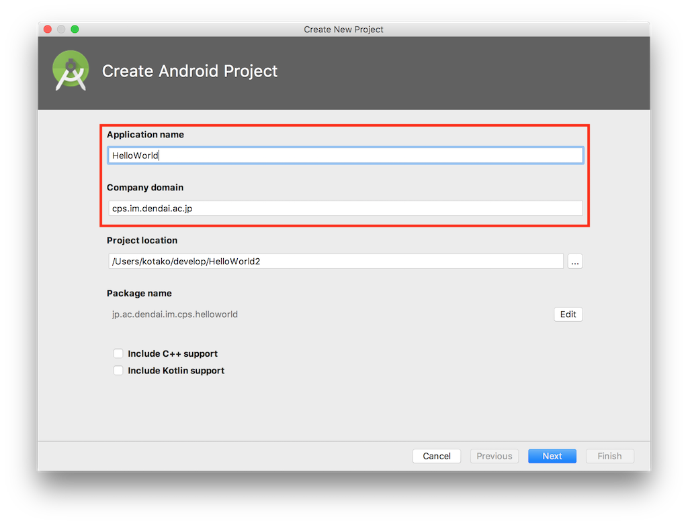
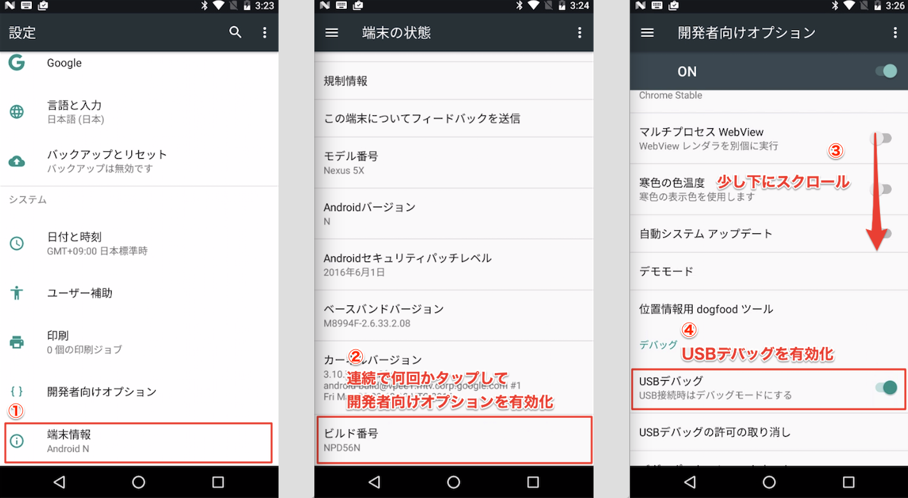

# CPSLAB Android Tutorial
この資料はCPSLABのゼミ生に向けたものです。  
[基礎編はこちら](./document.md)

# Create New Project
`Start a new Android Studio project`をクリック。  


`Application name`と`Company Domain`を入力してNextをクリック。  
`Company Domain`はなんでも良いけど`Package name`になるので自分でわかりやすい名前を付ける。  


`Phone and Tablet`にチェックをいれて`Minimum SDK`を選択します。  
`Minimum SDK`は動作する端末のAPIレベルの指定。指定したAPIレベル以上のAndroid端末でしか動きません。  


最初にAndroidStudioが初期化してくれる画面の選択。  
今回は`Empty Activity`を選択。  


Finishを選択。  


初期化が終わると下図のような画面が出てくるはずなので、とりあえず端末にインストールできるかチェック。  
上部にある緑色の三角のボタンを押す。  
このときに、インストールしたいAndroid端末をPCに接続しておく。  


そうすると下図のような画面が出てくるので、接続した端末を選んでOKをクリック。  


上でデバイスが表示されない場合は、Android端末をPCにUSBケーブルで接続し設定から以下の手順でUSBデバッグを有効化。  


下図のような画面がAndroid端末に表示されたら成功。  


# Activityで画面遷移
はじめに画面遷移を実装しよう。  

メイン画面のソースコードとレイアウトファイルは以下の場所にあります。  


まず`activity_main.xml`を開いてボタンを追加しよう。  
開くと下図のような画面がでてくるので左のPaletteからButtonをドラッグ＆ドロップでプレビューに追加する。  


ボタンをテキストの下、画面の左右中心に配置してみよう。   
ボタンの上枠の点を、Hello World!のテキストの下枠の点へドラッグすると、テキストの下に配置される。   
次にボタンの右枠の点を画面の右端へ、左枠の点を画面の左端へドラッグする。  


ついでに、右側のAttributesのID欄に`button`というIDが追加されている事を確認しておこう。  
ソースコードからボタンやテキストなどViewを取得したい時、このIDが必要となる。

## 遷移先の画面を作成

画面遷移後の画面を追加しよう。  
今回は`Activity`で画面遷移をするのでSubActivityを追加します。  
左側Projectツリーのパッケージ名(MainActivityが格納されているフォルダ)を右クリックし、New -> Activity -> Empty Activityと選択していきます。  


そうすると下図のような画面が表示されるので`Activity Name`と`Layout Name`を決めてFinishをクリック。  


`SubActivity.java`と`activity_sub.xml`が追加されました。  
`activity_sub.xml`を開き、先ほどと同じようにTextViewを追加してみよう。  

PaletteからTextViewをプレビューにドラッグ&ドロップする。  
次に、追加したTextViewの枠の点を各画面端へドラッグし、画面中央に配置する。  


## 画面遷移の処理を実装

次に`MainActivity.java`開き、Buttonにクリック処理を実装します。  

```java
public class MainActivity extends AppCompatActivity {

    @Override
    protected void onCreate(Bundle savedInstanceState) {
        super.onCreate(savedInstanceState);
        // レイアウトファイルとソースコードの紐付け
        setContentView(R.layout.activity_main);

        // 画面遷移用のIntentを作成
        final Intent intent = new Intent(this, SubActivity.class);

        // Buttonのインスタンスをレイアウトから取得
        Button button = (Button) findViewById(R.id.button);
        // Buttonにクリック処理を実装
        button.setOnClickListener(new View.OnClickListener() {
            @Override
            public void onClick(View v) {
                // intentにデータを付与。Activity間はこの方法でしかデータの受け渡しが不可能
                intent.putExtra("message", "サブ画面");
                // 画面遷移開始
                startActivity(intent);
            }
        });
    }
}
```
最後に`SubActivity.java`でさっきintentに付与したデータを取得してTextViewに表示します。  

```java
public class SubActivity extends AppCompatActivity {

    @Override
    protected void onCreate(Bundle savedInstanceState) {
        super.onCreate(savedInstanceState);
        setContentView(R.layout.activity_sub);

        Intent intent = getIntent();
        String text = intent.getStringExtra("message");

        TextView textView = (TextView) findViewById(R.id.textView);
        textView.setText(text);
    }
}
```

これで画面遷移が実装できました。  
さっきと同じく上部の三角ボタンをクリックしてAndroid端末にインストールしてみましょう。  
きちんと動作するはずです。  

## トラブルシューティング
何か問題があった場合は、エラーを確認してみたり、どんどん質問してみてください。
##### 実機にインストールすると、ボタンの場所がずれている
使用しているConstraintLayoutというレイアウトは、ボタンの枠の点が1つも接続されていないと、変な場所に配置されてしまいます。レイアウトファイルを見直してみてください。

##### 今回のアプリが落ちる場合に考えられること
- レイアウトに配置した要素のIDと、ソースコードから指定したIDが間違っていないか
- `Intent.putExtra()`の第一引数と、`intent.getStringExtra()`の引数が間違っていないか
- etc...
