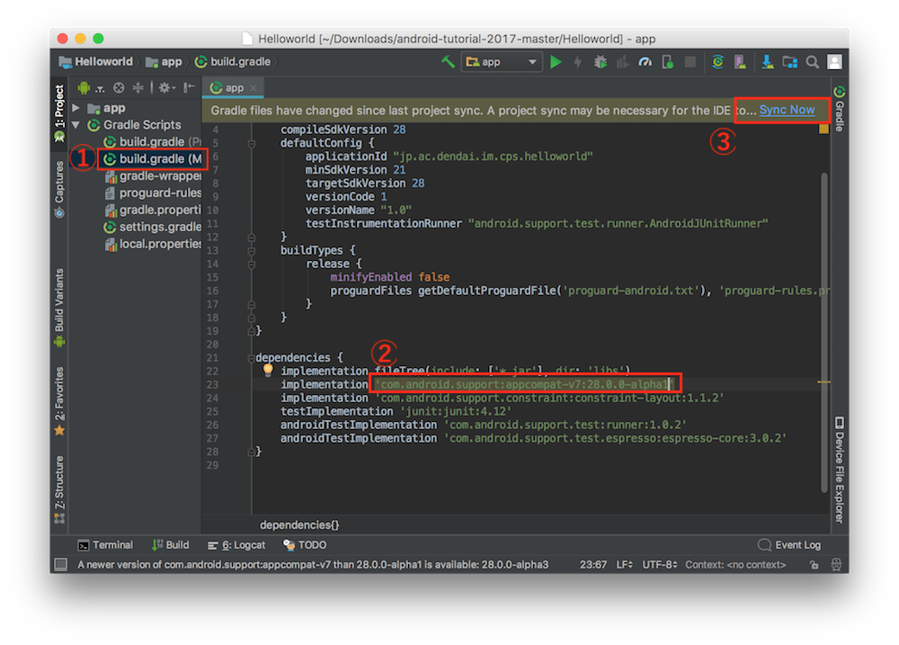
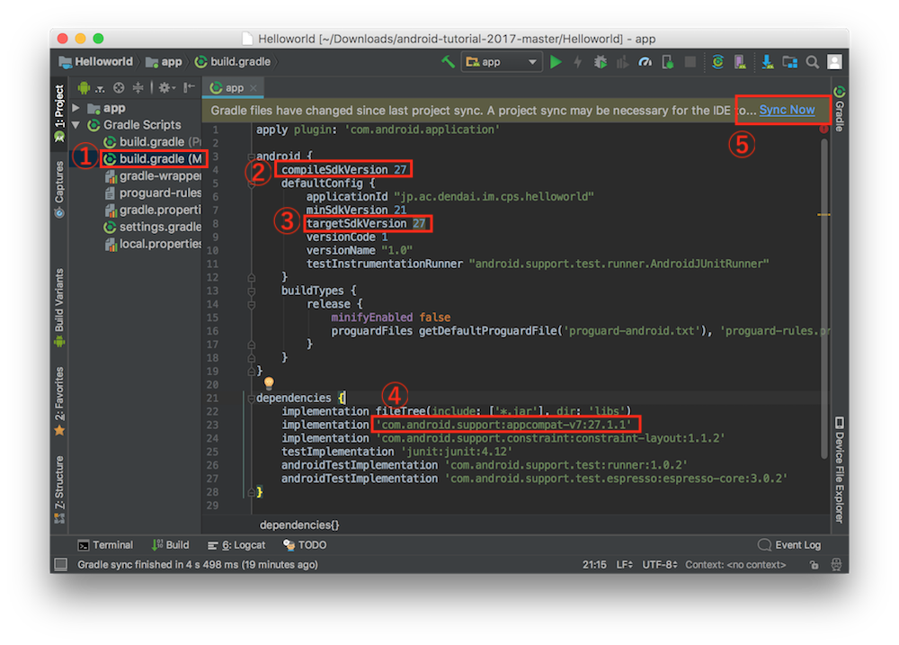

# 講義でのエラーについて

## 参考

stackoverflow に同様のエラーの質問がありました  
https://stackoverflow.com/questions/50736578/after-updating-android-studio-to-3-1-2-i-get-failed-to-load-appcompat-actionb

## 問題

新しい Android Studio で、開発に使用する Android sdk の初期バージョンが 28 に変更されていました…  
まだ 28 は安定版ではないので、sdk のバグのようです

## 解決策

いくつか解決策があるので、同様のエラーがでた時、試してみてください

1.  Android Support Library のバージョンを落とす  
    一番楽そうな解決策でした以下のスクリーンショットを参考に、バージョンを変更してみてください
    
    ① 上から 2 つめの`build.gradle`を開く  
    ②  枠部の末尾のバージョンを`28.0.0-alpha3`から`28.0.0-alpha1`へ変更  
    ③ Sync & Build!

2.  Android sdk のバージョンを変更する  
    講義の時間に行った方法ですが、手間がかかるので、1 で上手くいかない場合に試してください
    
    ① 上から 2 つめの`build.gradle`を開く  
    ②③ `compileSdkVersion`, `targetSdkVersion`を 27 に変更  
    ④ 枠部の末尾のバージョンを`28.0.0-alpha3`から`27.1.1`へ変更  
    ⑤ Sync & Build!
